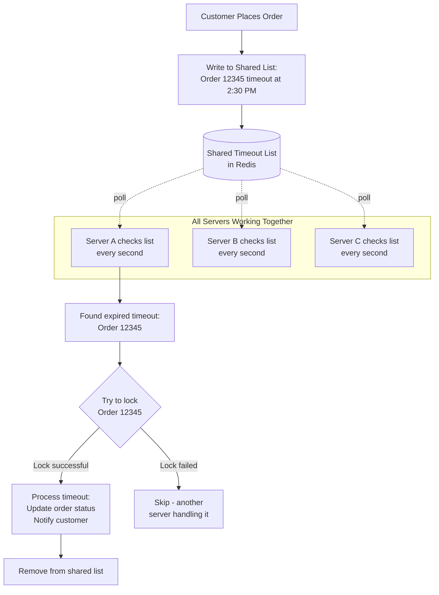
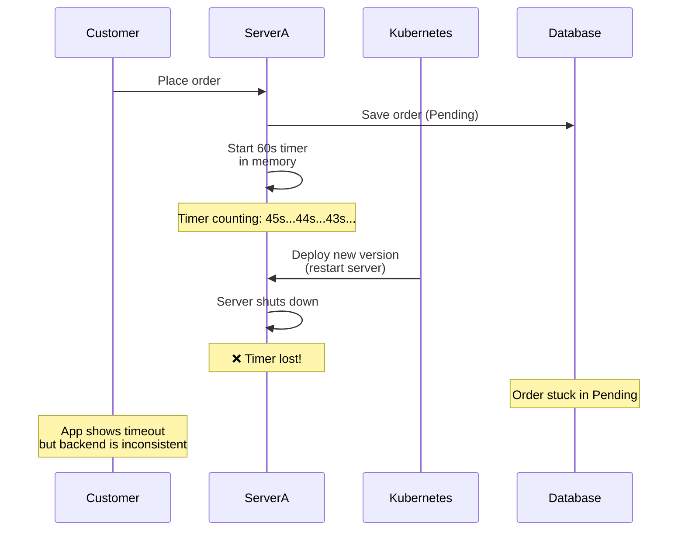
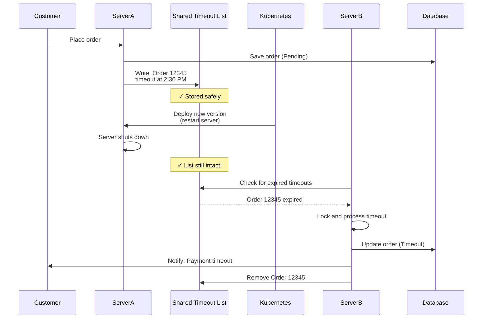

## The Problem (Quick Recap)

In our **[previous article](/p/rolling-virtual-thread)**, we explored a critical issue: when servers restart during deployment, in-memory timeout timers are lost, causing orders to get stuck in pending status indefinitely.

**The scenario**: A customer places an order and the system starts a 60-second timer. If payment isn't confirmed within 60 seconds, the order should automatically timeout. But if the server restarts at second 45, that timer disappears—and the order never times out. The customer sees "Order failed" on their screen, but the backend still thinks the order is active.

This creates confusion, duplicate orders, and requires manual cleanup.

---

## The Core Insight

The problem isn't with timers themselves—it's where we store the timer information. When we store timeout information **in the application's memory**, it disappears when the application restarts. 

The solution? **Move timeout tracking outside the application** into a shared storage system that survives restarts.

### The Calendar Analogy

Imagine two ways of tracking deadlines:

**Old Approach (In-Memory Timer)**  
Each employee has a desk calendar. When they mark "Review document by 3 PM," only they know about it. If they go home sick, no one else can see that deadline—it's lost.

**New Approach (Shared Storage)**  
The team uses a shared wall calendar in the office. When anyone marks "Review document by 3 PM," everyone can see it. If one person is unavailable, someone else can check the calendar and handle the task.

This is exactly what we're doing: moving from individual "desk calendars" (in-memory timers) to a "shared wall calendar" (Redis) that all servers can access.

---

## The Solution: Three Key Components

Our solution uses three simple concepts that work together:

### 1. The Shared Timeout List

**What it is**: A shared list where we write down every timeout and when it should happen, sorted by time.

**How it works**: When an order is created, instead of setting a timer in the server's memory, we write to this shared list: "Order #12345 should timeout at 2:30:15 PM."

**Why it survives restarts**: This list lives in a database-like storage system (Redis) that's separate from our application servers. When a server restarts, the list is still there, untouched.

**Analogy**: Like a shared to-do list on the wall, sorted by deadline. Everyone can see it, and it doesn't disappear when someone leaves the room.

### 2. The Worker Pattern

**What it is**: Every server regularly checks the shared timeout list to find tasks that are ready to be processed.

**How it works**: Every second, each server asks: "Are there any timeouts in the list that have already passed?" If it finds any, it processes them.

**Why it's resilient**: If one server goes down, the other servers keep checking the list. No single server is responsible for any specific timeout—they all share the work.

**Analogy**: Like multiple security guards on patrol. They all check the same checklist every few minutes. If one guard goes on break, the others keep checking—nothing gets missed.

### 3. The Lock (Preventing Duplicates)

**What it is**: A mechanism to ensure only one server processes each timeout, even though multiple servers are checking the list.

**How it works**: When Server A sees an expired timeout, it tries to "grab" it by placing a lock. If it succeeds, it processes the timeout. If Server B tries to grab the same timeout a moment later, it sees the lock and skips it—knowing Server A is already handling it.

**Why it's necessary**: Without locks, Server A and Server B might both process the same timeout, sending two "Order timed out" notifications to the customer.

**Analogy**: Like task cards on a Kanban board. When you start working on a task, you move the card to "In Progress." Other team members see it's being worked on and don't duplicate the effort.

---

## How It All Works Together

Let's walk through a complete timeout lifecycle:

**Step-by-step explanation**:

1. **Order Created**: Customer places Order #12345. The system writes to the shared list: "Order #12345, timeout at 2:30:15 PM"

2. **Servers Monitor**: All servers (A, B, C) independently check the shared list every second, asking "Any timeouts past their deadline?"

3. **Timeout Found**: At 2:30:16 PM, Server A checks and finds Order #12345 is past its deadline (by 1 second)

4. **Lock Attempt**: Server A tries to "lock" Order #12345. If successful, it proceeds. If another server locked it first, Server A skips it.

5. **Process Timeout**: Server A updates the order status to "Payment Timeout" and sends a notification to the customer

6. **Clean Up**: Server A removes Order #12345 from the shared list so no other server tries to process it

---

## What Happens During Deployment

This is where the new approach really shines. Let's compare the old and new systems during a rolling deployment:

### Old System: In-Memory Timer

**What goes wrong**: The timer lives only in Server A's memory. When Server A restarts, the timer is gone. Order #12345 never times out.

### New System: Shared Timeout List

**What goes right**: The timeout information lives in the shared list, not in Server A's memory. When Server A restarts, Server B (still running) finds the expired timeout and processes it. The customer gets the correct notification, and the order status is updated properly.

---

## Trade-offs and Considerations

No solution is perfect. Here's what we gained and what we accepted:

### ✅ Benefits

**Reliability**: Timeouts survive server restarts. During deployments, maintenance, or unexpected crashes, no timeout is lost.

**Scalability**: Works across any number of servers. Adding more servers means more workers checking the list—better throughput.

**Consistency**: The system state stays consistent. No more "ghost orders" that customers think failed but are still active in the backend.

### ⚖️ Trade-offs

**Small Processing Delay**: Instead of processing timeouts at exactly 60.000 seconds, we process them within ~61 seconds (60 seconds + up to 1 second for the worker to check the list).

- **Why it's acceptable**: For a 60-second timeout, a 1-second variance is imperceptible to customers. The business requirement is "notify within reasonable time," not "exactly at 60 seconds."

**Dependency on Shared Storage**: The system now depends on Redis (the shared storage) being available.

- **Why it's acceptable**: Redis is already a critical component for many features (caching, sessions). It's highly reliable with built-in redundancy. If Redis goes down, we have bigger problems than timeouts.

**Eventual Processing**: There's a brief window where a timeout has technically expired but hasn't been processed yet (while waiting for the next worker check).

- **Why it's acceptable**: The database check is idempotent—before processing, we verify the order is still in "Pending" status. If a payment came through at the last second, we skip the timeout.

---

## Real-World Impact

After deploying this solution to production:

| Metric | Before (In-Memory) | After (Shared List) |
|--------|-------------------|---------------------|
| Orders stuck during deployment | 5-10 per day | 0 |
| Average delay for stuck orders | 2-5 minutes | N/A |
| Manual cleanup required | Daily | Never |
| Customer complaints about "ghost orders" | Weekly | None |
| Timeout processing accuracy | Exact (but fails on restart) | Within 1 second (always works) |

The numbers speak for themselves. The small trade-off (1-second delay) is completely invisible to users, while the benefit (zero stuck orders) dramatically improves both user experience and operational efficiency.

---

## Key Takeaways

This solution teaches us several important principles that apply beyond just timeout handling:

### 1. Persistent State Survives Restarts

When critical information lives only in application memory, it disappears during restarts. Moving it to external, persistent storage makes it durable.

**Applies to**: Background jobs, scheduled tasks, workflow state, temporary data that users depend on.

### 2. Shared Storage Enables Distributed Work

When multiple servers can see the same work queue, they can share the load and provide redundancy. If one fails, others pick up the slack.

**Applies to**: Task queues, job scheduling, event processing, any work that can be distributed.

### 3. Locks Prevent Duplicate Processing

In distributed systems where multiple workers process the same queue, coordination (locks) ensures each item is processed exactly once.

**Applies to**: Payment processing, notification sending, any operation that shouldn't happen twice.

### 4. Small Delays Are Often Acceptable

Perfect timing (exactly 60.000 seconds) often isn't necessary. "Close enough" (60-61 seconds) is usually fine if it makes the system more reliable.

**Applies to**: Most user-facing features prioritize reliability over microsecond precision.

### 5. Idempotency Handles Edge Cases

By checking current state before acting ("Is the order still pending?"), the system gracefully handles race conditions and ensures consistency even if something processes twice.

**Applies to**: Any distributed operation, retry logic, eventual consistency scenarios.

---

## Conclusion

The journey from in-memory timers to shared timeout lists teaches a broader lesson: **in distributed systems, shared persistent state is more reliable than isolated in-memory state**.

While the old approach (spawn a thread, sleep, execute callback) is simpler to code, it breaks down under real-world conditions: deployments, restarts, scaling up or down. The new approach requires more infrastructure (Redis, workers, locks) but handles these conditions gracefully.

For systems running in production—especially in containerized environments like Kubernetes where restarts are routine—this architectural pattern is essential. Whether you're building e-commerce, ride-sharing, job scheduling, or any system with time-dependent logic, the same principles apply:

- **Persist critical state** outside your application
- **Distribute the work** across multiple workers
- **Coordinate with locks** to prevent duplicates
- **Accept small delays** for much better reliability

The result is a system that works consistently, even when individual servers come and go—which is exactly what modern cloud infrastructure demands.
