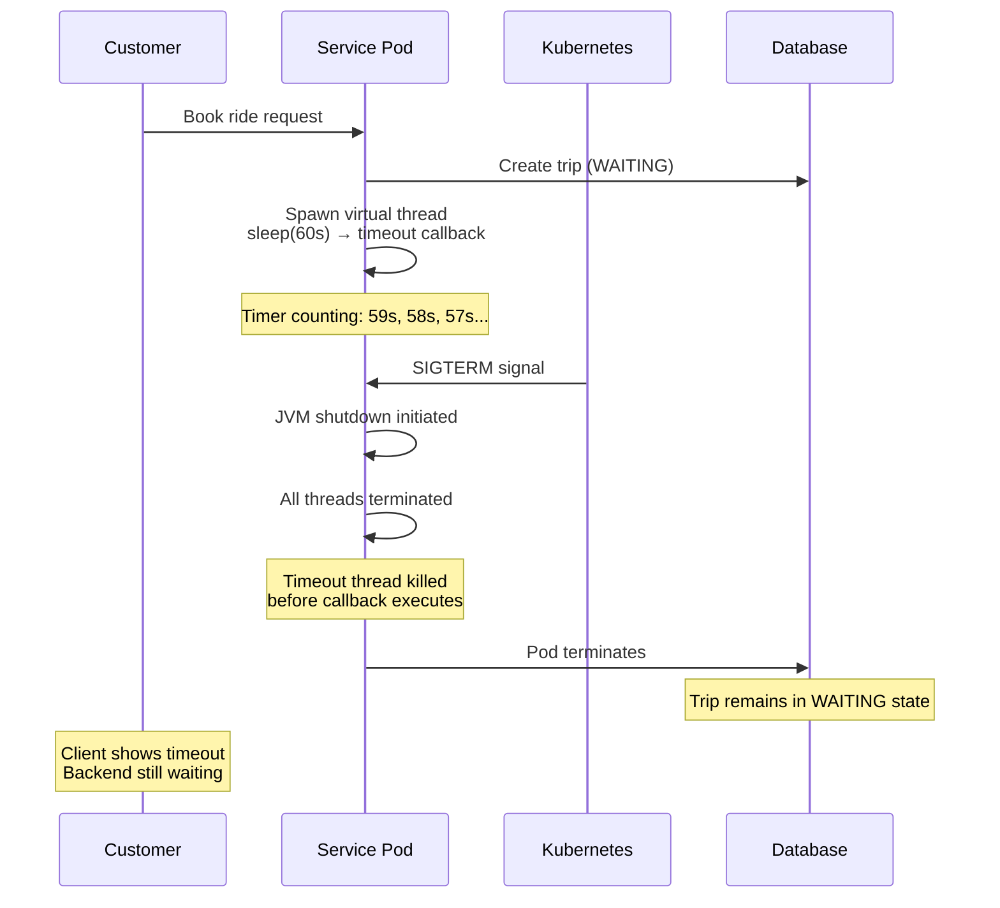

## The Problem

During a recent rolling deployment, our ride-sharing system encountered a critical issue: trips that should have timed out after 60 seconds remained in a **WAITING** status for 120-180 seconds, causing inconsistent system behavior and user confusion.

In our system, when a customer books a ride, we attempt to match them with an available driver. We enforce a strict 60-second timeout window to find a driver. If no driver is found within this timeframe, the system should automatically return a "Driver Not Found" response and update the trip status accordingly.

Under normal operating conditions, this mechanism works perfectly. However, during rolling deployments, we observed that some trips exceeded their timeout limits by 2-3x, creating a dangerous inconsistency between what the client displayed and the actual backend state.

---

## Understanding the System Architecture

### Virtual Threads Overview

Our system leverages **Java Virtual Threads** (introduced in Java 19 as a preview and finalized in Java 21) to handle timeout mechanisms efficiently. Virtual threads are lightweight threads managed by the Java Virtual Machine, allowing us to create millions of threads without the overhead of traditional platform threads.

For our timeout implementation, we spawn a virtual thread that sleeps for the duration of the timeout period (60 seconds). When the timeout expires, the thread executes a callback function that handles the "driver not found" scenario.

### The Timeout Mechanism

The timeout flow works as follows:

1. **Trip Creation**: When a customer initiates a booking, the system creates a trip record with status `WAITING`
2. **Timer Initialization**: A virtual thread is spawned to handle the timeout countdown
3. **Driver Matching**: The system attempts to find and assign an available driver
4. **Success Path**: If a driver is found, the timer thread is interrupted and the trip status is updated to `ASSIGNED`
5. **Timeout Path**: If no driver is found within 60 seconds, the timer thread executes the timeout callback, updating the trip status to `DRIVER_NOT_FOUND`

This design works reliably in stable environments, but reveals a critical flaw during deployment scenarios.

---

## The Deployment Failure Scenario

During a rolling deployment in Kubernetes, the following sequence of events occurs:



### What Happens During Rolling Deployment

1. **Normal Operation**: A trip is created and a virtual thread starts the 60-second countdown
2. **Deployment Triggered**: Kubernetes initiates a rolling deployment, sending a `SIGTERM` signal to the pod
3. **JVM Shutdown**: The Java Virtual Machine begins its shutdown sequence
4. **Thread Termination**: All threads, including our timeout virtual thread, are terminated immediately
5. **Callback Never Executes**: The timeout callback that should update the trip status never fires
6. **State Inconsistency**: The trip remains in `WAITING` status indefinitely, while the client has already shown a timeout error

### Code Example

Here's a simplified version of the problematic implementation:

```java
public void createTrip(TripRequest request) {
    // Create trip in database
    Trip trip = tripRepository.save(new Trip(request, Status.WAITING));
    
    // Spawn virtual thread for timeout
    Thread.ofVirtual().start(() -> {
        try {
            Thread.sleep(60_000); // 60 seconds
            handleDriverNotFound(trip.getId());
        } catch (InterruptedException e) {
            // Driver found, timer interrupted - this is the happy path
            Thread.currentThread().interrupt();
        }
    });
    
    // Attempt to find driver
    findAndAssignDriver(trip.getId());
}

private void handleDriverNotFound(Long tripId) {
    // This callback never executes if pod is killed during deployment
    tripRepository.updateStatus(tripId, Status.DRIVER_NOT_FOUND);
}
```

The critical issue is that `handleDriverNotFound()` never executes if the JVM is terminated before the 60-second sleep completes.

---

## Why This Is Dangerous

This failure mode creates a dangerous inconsistency between client and server states:

| Client View | Backend Reality |
|-------------|-----------------|
| Shows "Trip failed" or timeout error | Trip still in `WAITING` status |
| User creates a new trip | Original trip still active in database |
| User assumes booking failed | System still waiting for driver assignment |
| Driver accepts late (after timeout) | Conflict: trip already considered failed by client |

### Real-World Impact

This inconsistency leads to several critical problems:

- **Ghost Bookings**: Trips that appear failed to users but remain active in the system
- **Double Driver Assignment**: A driver might accept a trip that the user believes has already failed, leading to confusion
- **Data Integrity Issues**: The system state becomes inconsistent, making it difficult to track actual trip status
- **User Trust Erosion**: Users experience unreliable behavior, damaging confidence in the platform
- **Debugging Complexity**: Production issues become difficult to trace because the failure is silent and state-dependent

---

## Root Cause Analysis

The fundamental problem is architectural: **we relied entirely on an in-memory timeout mechanism with no persistence or recovery strategy**.

### Key Issues

1. **No State Persistence**: The timeout state exists only in memory. When the JVM terminates, this state is lost forever.

2. **No Graceful Shutdown Handling**: The application doesn't handle shutdown signals to complete pending timeout operations before termination.

3. **No Recovery Mechanism**: There's no background process to detect and recover trips that should have timed out but didn't.

4. **Tight Coupling**: The timeout logic is tightly coupled to the application lifecycle. When the application dies, the timeout dies with it.

### Why Virtual Threads Don't Help Here

While virtual threads are excellent for handling many concurrent operations efficiently, they don't solve the fundamental problem of persistence. Virtual threads are still in-memory constructs that disappear when the JVM terminates. The solution requires moving the timeout mechanism outside of the application's memory space.

---

## The Solution: Persistent Timeout Mechanism

In our next article, we'll explore how we solved this problem by implementing a **persistent timeout mechanism using Redis Sorted Sets (ZSET)** combined with a **recovery worker pattern**.

This approach ensures that:

- Timeout state is persisted outside the application memory
- Timeouts survive pod restarts and deployments
- A dedicated worker process can recover and process missed timeouts
- The system maintains consistency even during infrastructure changes

The solution leverages Redis ZSET's ability to store timeout timestamps as scores, allowing efficient querying of expired timeouts, while a background worker continuously processes these timeouts regardless of which pod originally created them.

Stay tuned for the detailed implementation in the next post!
---
title: When Virtual Threads Fail During Rolling Deployments
description: How in-memory timeout threads can cause production issues during Kubernetes rolling deployments, and why we need persistent timeout mechanisms.
slug: rolling-virtual-thread
date: 2025-12-30 00:00:00+0000
categories:
    - Design System
    - Virtual Thread
    - Redis
    - Production Issues
    - Syntax
# weight: 1       # You can add weight to some posts to override the default sorting (date descending)
---

## The Problem

During a recent rolling deployment, our ride-sharing system encountered a critical issue: trips that should have timed out after 60 seconds remained in a **WAITING** status for 120-180 seconds, causing inconsistent system behavior and user confusion.

In our system, when a customer books a ride, we attempt to match them with an available driver. We enforce a strict 60-second timeout window to find a driver. If no driver is found within this timeframe, the system should automatically return a "Driver Not Found" response and update the trip status accordingly.

Under normal operating conditions, this mechanism works perfectly. However, during rolling deployments, we observed that some trips exceeded their timeout limits by 2-3x, creating a dangerous inconsistency between what the client displayed and the actual backend state.

---

## Understanding the System Architecture

### Virtual Threads Overview

Our system leverages **Java Virtual Threads** (introduced in Java 19 as a preview and finalized in Java 21) to handle timeout mechanisms efficiently. Virtual threads are lightweight threads managed by the Java Virtual Machine, allowing us to create millions of threads without the overhead of traditional platform threads.

For our timeout implementation, we spawn a virtual thread that sleeps for the duration of the timeout period (60 seconds). When the timeout expires, the thread executes a callback function that handles the "driver not found" scenario.

### The Timeout Mechanism

The timeout flow works as follows:

1. **Trip Creation**: When a customer initiates a booking, the system creates a trip record with status `WAITING`
2. **Timer Initialization**: A virtual thread is spawned to handle the timeout countdown
3. **Driver Matching**: The system attempts to find and assign an available driver
4. **Success Path**: If a driver is found, the timer thread is interrupted and the trip status is updated to `ASSIGNED`
5. **Timeout Path**: If no driver is found within 60 seconds, the timer thread executes the timeout callback, updating the trip status to `DRIVER_NOT_FOUND`

This design works reliably in stable environments, but reveals a critical flaw during deployment scenarios.

---

## The Deployment Failure Scenario

During a rolling deployment in Kubernetes, the following sequence of events occurs:


### What Happens During Rolling Deployment

1. **Normal Operation**: A trip is created and a virtual thread starts the 60-second countdown
2. **Deployment Triggered**: Kubernetes initiates a rolling deployment, sending a `SIGTERM` signal to the pod
3. **JVM Shutdown**: The Java Virtual Machine begins its shutdown sequence
4. **Thread Termination**: All threads, including our timeout virtual thread, are terminated immediately
5. **Callback Never Executes**: The timeout callback that should update the trip status never fires
6. **State Inconsistency**: The trip remains in `WAITING` status indefinitely, while the client has already shown a timeout error

### Code Example

Here's a simplified version of the problematic implementation:

```java
public void createTrip(TripRequest request) {
    // Create trip in database
    Trip trip = tripRepository.save(new Trip(request, Status.WAITING));
    
    // Spawn virtual thread for timeout
    Thread.ofVirtual().start(() -> {
        try {
            Thread.sleep(60_000); // 60 seconds
            handleDriverNotFound(trip.getId());
        } catch (InterruptedException e) {
            // Driver found, timer interrupted - this is the happy path
            Thread.currentThread().interrupt();
        }
    });
    
    // Attempt to find driver
    findAndAssignDriver(trip.getId());
}

private void handleDriverNotFound(Long tripId) {
    // This callback never executes if pod is killed during deployment
    tripRepository.updateStatus(tripId, Status.DRIVER_NOT_FOUND);
}
```

The critical issue is that `handleDriverNotFound()` never executes if the JVM is terminated before the 60-second sleep completes.

---

## Why This Is Dangerous

This failure mode creates a dangerous inconsistency between client and server states:

| Client View | Backend Reality |
|-------------|-----------------|
| Shows "Trip failed" or timeout error | Trip still in `WAITING` status |
| User creates a new trip | Original trip still active in database |
| User assumes booking failed | System still waiting for driver assignment |
| Driver accepts late (after timeout) | Conflict: trip already considered failed by client |

### Real-World Impact

This inconsistency leads to several critical problems:

- **Ghost Bookings**: Trips that appear failed to users but remain active in the system
- **Double Driver Assignment**: A driver might accept a trip that the user believes has already failed, leading to confusion
- **Data Integrity Issues**: The system state becomes inconsistent, making it difficult to track actual trip status
- **User Trust Erosion**: Users experience unreliable behavior, damaging confidence in the platform
- **Debugging Complexity**: Production issues become difficult to trace because the failure is silent and state-dependent

---

## Root Cause Analysis

The fundamental problem is architectural: **we relied entirely on an in-memory timeout mechanism with no persistence or recovery strategy**.

### Key Issues

1. **No State Persistence**: The timeout state exists only in memory. When the JVM terminates, this state is lost forever.

2. **No Graceful Shutdown Handling**: The application doesn't handle shutdown signals to complete pending timeout operations before termination.

3. **No Recovery Mechanism**: There's no background process to detect and recover trips that should have timed out but didn't.

4. **Tight Coupling**: The timeout logic is tightly coupled to the application lifecycle. When the application dies, the timeout dies with it.

### Why Virtual Threads Don't Help Here

While virtual threads are excellent for handling many concurrent operations efficiently, they don't solve the fundamental problem of persistence. Virtual threads are still in-memory constructs that disappear when the JVM terminates. The solution requires moving the timeout mechanism outside of the application's memory space.

---

## The Solution: Persistent Timeout Mechanism

In our next article, we'll explore how we solved this problem by implementing a **persistent timeout mechanism using Redis Sorted Sets (ZSET)** combined with a **recovery worker pattern**.

This approach ensures that:

- Timeout state is persisted outside the application memory
- Timeouts survive pod restarts and deployments
- A dedicated worker process can recover and process missed timeouts
- The system maintains consistency even during infrastructure changes

The solution leverages Redis ZSET's ability to store timeout timestamps as scores, allowing efficient querying of expired timeouts, while a background worker continuously processes these timeouts regardless of which pod originally created them.

Stay tuned for the detailed implementation in the next post!
